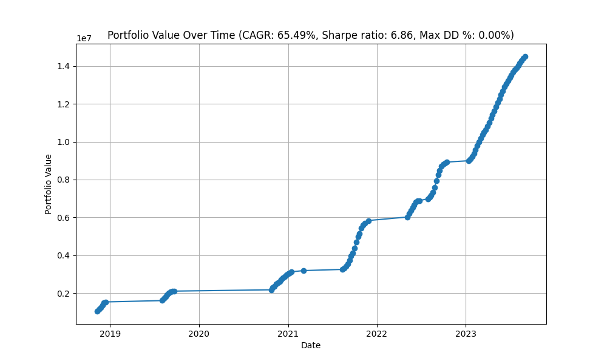
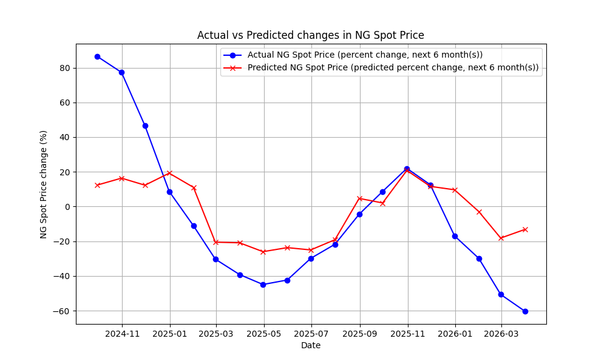
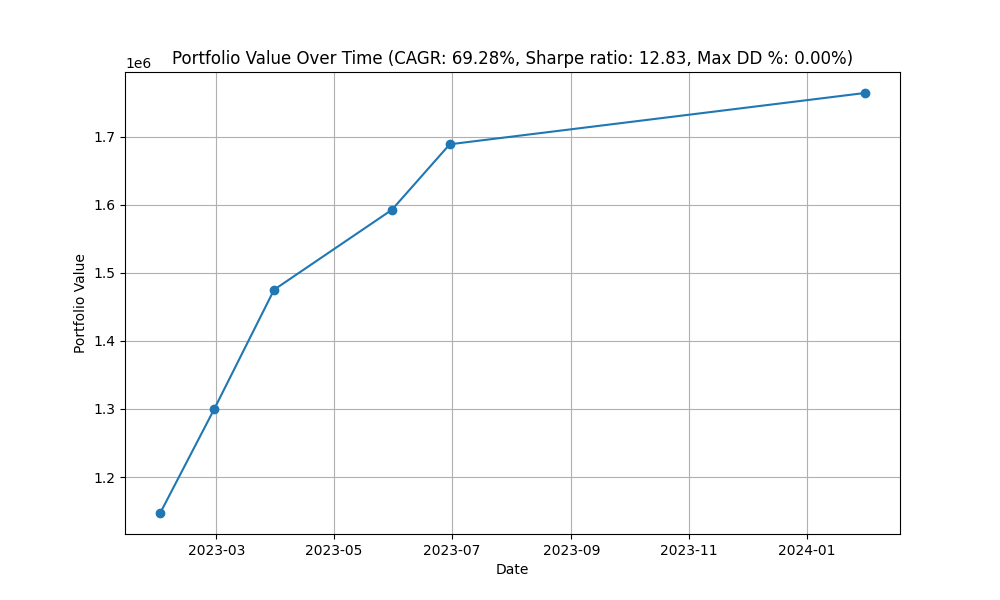

# verbose-octo-journey

Forecasting prices of Henry Hub Natural Gas Futures (NYMEX:NG1!)


 


22-05-24: 
```
Training:

Mean Absolute Error: 0.3829875579601106
Root Mean Squared Error: 0.48223190373640573
                               Feature  Importance
1  Cushing OK WTI Spot Price FOB $/bbl   18.375541
4    Europe Brent Spot Price FOB $/bbl   16.635741
6                         Imports_MMcf   15.156283
8        Plant_Liquids_Production_MMcf   12.274401
0                 CORESTICKM159SFRBATL   12.266013
2                             DTWEXBGS    8.789367
7             Marketed_Production_MMcf    7.753190
3      Dry_Natural_Gas_Production_MMcf    5.150494
5               Gross_Withdrawals_MMcf    3.598970
```

23-05-24
```

Training:

Mean Absolute Error: 0.3565561787495663
Root Mean Squared Error: 0.45859897346198075
                                Feature  Importance
1   Cushing OK WTI Spot Price FOB $/bbl   22.612712
5     Europe Brent Spot Price FOB $/bbl   11.676842
12                                 Salt   10.036134
11        Plant_Liquids_Production_MMcf    6.993827
0                  CORESTICKM159SFRBATL    6.885862
9                       Mountain Region    6.545815
4                           East Region    6.443635
7                          Imports_MMcf    6.077576
10                       Pacific Region    5.804332
8              Marketed_Production_MMcf    5.155749
2                              DTWEXBGS    4.892531
6                Gross_Withdrawals_MMcf    4.517890
3       Dry_Natural_Gas_Production_MMcf    2.357097
```

27-05-2024
```

Training:

Mean Absolute Error: 0.3667739328646564
Root Mean Squared Error: 0.4822559210680101
                                Feature  Importance
5     Europe Brent Spot Price FOB $/bbl   27.598614
1   Cushing OK WTI Spot Price FOB $/bbl   12.306035
2                              DTWEXBGS   10.228230
0                  CORESTICKM159SFRBATL    9.776528
11        Plant_Liquids_Production_MMcf    8.864959
12                                 Salt    5.772033
10                       Pacific Region    4.081074
4                           East Region    3.969586
7                          Imports_MMcf    3.776993
6                Gross_Withdrawals_MMcf    3.390039
8              Marketed_Production_MMcf    3.149448
9                       Mountain Region    2.375543
3       Dry_Natural_Gas_Production_MMcf    1.311655
16                                 wind    1.263633
13             hurricane_force_diameter    0.862160
14                             pressure    0.645310
15         tropicalstorm_force_diameter    0.628161
```

Data sources:
- https://fred.stlouisfed.org/series/MEDCPIM158SFRBCLE
- https://www.eia.gov/dnav/ng/ng_move_impc_s1_m.htm
- https://ir.eia.gov/ngs/ngs.html
- https://www.eia.gov/dnav/ng/ng_pri_fut_s1_w.htm
- https://www.eia.gov/dnav/ng/ng_prod_sum_dc_NUS_MMCF_m.htm
- https://www.eia.gov/dnav/ng/hist/rngwhhdm.htm
- https://fred.stlouisfed.org/series/DTWEXBGS

Test data is synthetically generated by Claude.